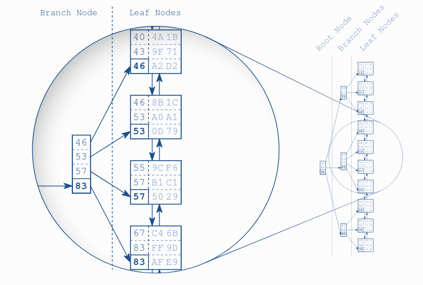

# Balanced search tree

A branch layer is built up unit all the leaf nodes are covered by a branch node. The next layer is built similarly, but on top of the first branch node level. The procedure repeats until all keys fit into a single node, the `root node`.

The structure is _balanced_ because the tree depth is equal at every position; the distance between root node and leaf nodes is the same everywhere.

## Traversal

The tree traversal starts at the root node on the left-hand side. Each entry is processed in ascending order until a value is greater than or equal to (>=) the search term (57). In the figure it is the entry 83. The database follows the reference to the corresponding branch node and repeats the procedure until the tree traversal reaches a leaf node.

Traversing the tree is so efficient that it works almost instantly -even on huge data sets. That is primarily because of the tree balance, which allows accessing all elements with the same number of steps and, secondly, because of the [[notes/f7f1b791]] of the tree depth. That is, the tree depth grows very slowly compared to the number of leaf nodes.

Databases exploit this concept to a maximum extent and put as many entries as possible into each node—often hundreds. That means that every new index level supports a hundred times more entries.

## Resource

- [The Search Tree (B-Tree) Makes the Index Fast](https://use-the-index-luke.com/sql/anatomy/the-tree)
- [B+tree simulator](https://www.cs.usfca.edu/~galles/visualization/BPlusTree.html)
