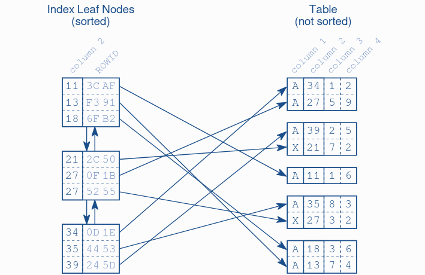
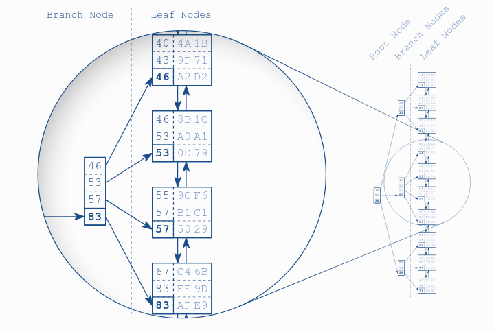

# [Use the index, Luke!](https://use-the-index-luke.com/)

## [Preface](https://use-the-index-luke.com/sql/preface)

SQL is perhaps the most successful fourth-generation programming language. Its main benefit is the capability to separate *what* and  *how*. An SQL statement is a straight description of *what* is needed without instructions as to *how* to get it done.

The aforementioned abstraction reaches its limits when it comes to performance: the author of an SQL statement by definition does _not_ care about *how* the database executes the statement. Consequently, the author is not responsible for slow execution. However, experience proves the opposite; i.e., the author _must_ know a little bit about the database to prevent performance problems.

It turns out that the *only* thing developers need to learn is how to index. The most important information for indexing is how the applications queries the data.

This book book covers the most important index type only: *B-tree index*.

## [Anatomy of an index](https://use-the-index-luke.com/sql/anatomy)

An index is pure redundancy. Creating an index does not change the table data; it just creates a new data structure that refers to the table.

Once indexed, all elements are arranged in a well-defined order, thus making finding data fast and easy since the sort order determines each entry's position.

Given the constant changes that a DB goes through, an index must be able to keep on sync in a timely fashion, without moving large amounts of data. In order to accomplish those goals, the database combines two distinct data structures: a `doubly linked list` and a `search tree`. This two data structures explain most of the database's performance characteristics.

### [The index leaf nodes](https://use-the-index-luke.com/sql/anatomy/the-leaf-nodes)

The primary purpose of an index is to provide an ordered representation of the indexed data. It is, however, not possible to store the data sequentially because an `INSERT` statement would need to move the following entries to fit the new one. The solution is to establish a logical order that is independent of the physical order in memory. Enter the [[notes/fa4fc8e8]].

Databases use doubly linked lists to connect the so-called index _leaf nodes_. Each leaf node is stored in a database _block_ or _page_; the database's smallest storage unit. All index blocks are the same size, typically a few kilobytes. Each block stores as many index entries as possible. The order is thus maintained in two different levels: the index entries within each leaf node, and the leaf nodes among each other using the doubly linked list.

### [The Search Tree (B-Tree) Makes the Index Fast](https://use-the-index-luke.com/sql/anatomy/the-tree)

A database needs a second data structure to find an entry among the shuffled _blocks_ quickly: a [[notes/31b03986]]

Once created, the database maintains the index automatically. It applies every `INSERT`, `DELETE` and `UPDATE` to the index and keeps the tree in balance, thus causing maintenance overhead for write operations.

### [Slow Indexes, Part I](https://use-the-index-luke.com/sql/anatomy/slow-indexes)

The first ingredient for a slow index lookup is the leaf node chain. An index lookup not only needs to perform the tree traversal, but it also needs to follow the leaf node chain if more than one match is to be expected.

The second ingredient for a slow index lookup is accessing the table. Even a single leaf node might contain many hits, often hundreds. The corresponding table data is usually scattered across many blocks, meaning that there is additional tables access for each hit.

An index lookup, thus, requires three steps:

1. The tree traversal
2. Following the leaf chain
3. Fetching the table data

Only the first steps has an upper-bound, the tree depth. The remaining two might need to access many blocks, causing a slow index lookup. The belief that an index lookup just traverses the tree is what encourages the `degenerated index` myth.

#### INDEX UNIQUE SCAN

It performs the tree traversal only, if a unique constraint ensures that the search criteria will match no more than one entry.

#### INDEX RANGE SCAN

It performs the tree traversal and follows the leaf node chain to find all matching entries. This is the fall­back operation if multiple entries could possibly match the search criteria. It can potentially read a large part of an index. If there is one more table access for each row, the query can become slow even when using an index.

#### TABLE ACCESS BY INDEX ROWID

It retrieves the row from the table. This operation is (often) performed for every matched record from a preceding index scan operation.

## [The Where Clause](https://use-the-index-luke.com/sql/where-clause)

The `WHERE` clause defines the search condition of an SQL statement, and it this falls into the core functional domain of an index: finding data quickly. Its often careless implementation leads to slow queries.

### [The Equals Operator](https://use-the-index-luke.com/sql/where-clause/the-equals-operator)

The equality operator is both the most trivial and the most frequently used SQL operator.

#### [Primary Keys](https://use-the-index-luke.com/sql/where-clause/the-equals-operator/primary-keys)

Ingredients of a slow query are not present with a `INDEX UNIQUE SCAN` triggered by a equality operation on a primary key; a single `TABLE ACCESS BY INDEX ROWID` is performed since it cannot deliver more than one entry.

#### [Concatenated Indexes](https://use-the-index-luke.com/sql/where-clause/the-equals-operator/concatenated-keys)

A concatenated index (also known as composite or combined index) encompass two or more table columns. The order of said columns greatly impacts the usability of the index, so it must be chosen carefully.

When all columns associated to a composite index are used in the `WHERE` clause, the database is able to perform a `INDEX UNIQUE SCAN`, no matter how many records exists. Unfortunately this is not the case when only some of the columns are used, making the database perform a [FULL TABLE SCAN](#full-table-scan), whose performance is directly tied to the number of records in the table.

A concatenated index is just a B-tree index like any other that keeps the indexed data in a sorted list . The database considers each column according to its position in the index definition to sort the index entries. The first column is the primary sort criterion and the second column determines the order only if two entries have the same value in the first column an so on.

We should query by the leftmost columns of the index to take as much advantage of it as possible. To define an optimal index you must understand more than just how indexes work - you must also know how the application uses the data.

#### [Slow Indexes, Part II](https://use-the-index-luke.com/sql/where-clause/the-equals-operator/slow-indexes-part-ii)

If there are multiple access paths to out data, it's the [optimizer's](#the-query-optimizer) job to choose the best one. Choosing the best execution plan depends on the table's data distribution, so the optimizer uses [statistics](#statistics) about the contents of the database.

Ingredients that make an index slow:

- The database reads a wide index range
- The need to fetch many rows individually

Using an index _does not_ automatically mean an statement is executed in the best way possible.

### [Functions](https://use-the-index-luke.com/sql/where-clause/functions)

Standard indexes can't automatically be  used when transforming the indexed column with a function, since the database is unable to predict the function result, is _must_ do a `TABLE ACCESS FULL` in order to retrieve correct results. Thus, a `function-based index` (`FBI`) is needed.

A `function-based index` does not directly copy the data, as a standard index would, but rather transforms it first and then indexes it. The database can use a `function-based index` if the _exact_ expression of the index definition appears in an SQL statement.

#### [User-Defined Functions](https://use-the-index-luke.com/sql/where-clause/functions/user-defined-functions)

The serve similar purposes as the database-provided functions, but they have a specific limitation: the functions *must* be deterministic. That means, the result should always be the same, given the same set of parameters.

The reason for the deterministic limitation is simple. When inserting a new row, the database calls the function and stores the result and there it stays, unchanged. There is no periodic process that updates it. It will soon be out of date or plain wrong.

> PostgreSQL and Oracle database trust the `DETERMINISTIC` or `INMUTABLE` declaration - that means the trust the developer.

#### [Over-Indexing](https://use-the-index-luke.com/sql/where-clause/functions/over-indexing)

You might be tempted to index everything given the performance benefits described up until this point. Unfortunately, every additional index causes ongoing maintenance. Function-based indexes are particularly troublesome because they make it very easy to create redundant indexes.

### [Parameterized Queries](https://use-the-index-luke.com/sql/where-clause/bind-parameters)

Bind parameters-also called dynamic parameters or bind variables- are an alternative way to pass data to the database. Instead of putting the values directly into the SQL statement, you use a placeholder like `?`. They are the best way to prevent SQL injection.

#### Performance

Databases with an execution plan cache can reuse an execution plan when executing the same statement multiple times, but the query must be *exactly* the same. When using bind parameters the database is able to reuse previous execution plans, at the cost of optimizing none of them

Since no concrete values are known up to that point, the optimizer is unable to use the available statistics and it rather assumes an equal distribution. In the end, it will *always select the same execution plan*.

By using bind parameters we trade execution performance for compilation performance.

> Only the question mark (`?`) is defined as a placeholder by the SQL standard. Many databases offer a proprietary extension for named parameters, such as the at symbol (`@`) and the colon (`:`).

> Bind parameters cannot change the structure of an SQL statement; bind parameters cannot be used for table or column names.

## Notes

### FULL TABLE SCAN

It can be the most efficient operation in cases where we seek to retrieve a large part of the table. This is partly due to the overhead for the index lookup itself, which does not happen for a `FULL TABLE SCAN` operation.

An index lookup reads one block after the other as the database does not know which block to read next until the current block has been processed. A `FULL TABLE SCAN` can read larger chunks at a time; although the database reads more data, it performs less read operations.

### The query optimizer

The database component that transforms SQL statements into an `execution plan`, also called `compiling` or `parsing`. There are two distinct optimizer types:

- Cost-based optimizers (CBO)

    They generate many execution plan variations and calculate a `cost` value for each plan, which serves as the benchmark for picking the _best_ execution plan.
- Rule-based optimizers (RBO)

    They generate a plan using a hard-coded rule set. They are less flexible and are seldom used today.

### Statistics

Most statistics are collected on the column level: the number of distinct values, the smallest and the largest values, the number of `NULL` occurrences and the column histogram. The most important statistical value is its `size` (in rows and blocks).

The most important index statistics are the three depth, the number of leaf nodes, the number of distinct keys and the clustering factor.

The optimizer uses this values to estimate the selectivity of the `WHERE` clause predicates.

## Advice

- After every index change, update the statistics for the base table and all its indexes. If omitted, wrong estimations would be done, and suboptimal execution plan will be performed.
- Unify the access path so one index can be used by several queries.
Always aim to index the original data as that is often the most useful information you can put in an index.
- Use bind parameters, mainly to prevent SQL injection. Stop using them if the come to represent a performance issue.
